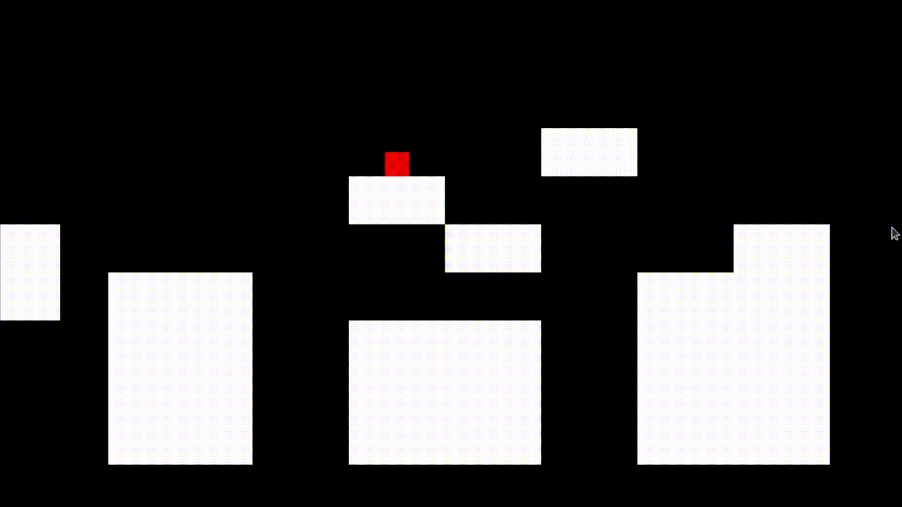
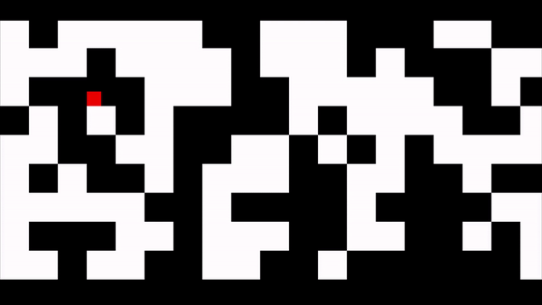

# A 2D Platformer game built using Python 3.8.10 and Pygame 2.1.2

This game is an experiment to test procedural generation of game levels. I hope to gain a very deep insight in probablity theory and statistics while working on this project.

The [Random](https://docs.python.org/3/library/random.html) Lib of python, is known for its'  Pseudo Random Number Generation capability.

> Almost all module functions depend on the basic function random(), which generates a random float uniformly in the semi-open range [0.0, 1.0). Python uses the Mersenne Twister as the core generator. It produces 53-bit precision floats and has a period of 2**19937-1. The underlying implementation in C is both fast and threadsafe. The Mersenne Twister is one of the most extensively tested random number generators in existence. However, being completely deterministic, it is not suitable for all purposes, and is completely unsuitable for cryptographic purposes.

***
## Following are my experiments on differerent random distributions and different implementations for each to find what may be suitable for a 2D-game.

Using the *random.randint()* function to make a 2D random variable to fill the screen with blocks and empty spaces with any sort of manipulation looks like the following.

***

This project was inspired by the Youtube channel [Clear Code](https://www.youtube.com/channel/UCznj32AM2r98hZfTxrRo9bQ). I learnt to use the [Pygame](https://www.pygame.org/wiki/about) library using his tutorials as a reference. Here is his [GitHub](https://github.com/clear-code-projects).

***
